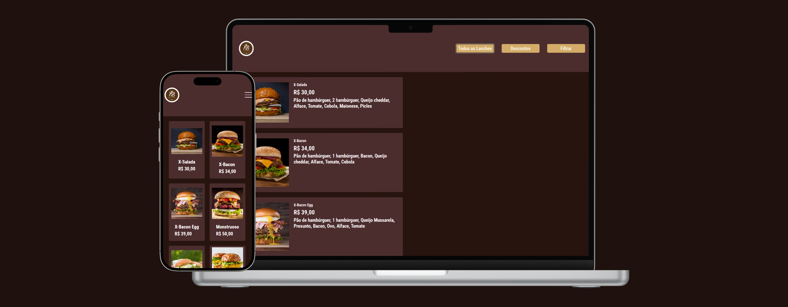

# NB HAMBURGUES

NB HAMBURGUES é um projeto de um site para uma hamburgueria, desenvolvido com HTML, CSS e JavaScript. O site apresenta um menu interativo com funcionalidades para listar, filtrar, calcular o total e exibir descontos nos lanches disponíveis. **[Link do projeto](https://davirrocha.github.io/projeto-filter/)**

##  Tecnologias Utilizadas

- HTML5: Estrutura do site.

- CSS3: Estilização do layout.

- JavaScript: Lógica para interação com o usuário.

## Funcionalidades

- Listar Todos os Lanches: Exibe todos os itens do cardápio.

- Exibir Descontos: Aplica descontos em determinados produtos.

- Filtrar Produtos: Permite ao usuário visualizar apenas itens específicos.

- Calcular Total: Soma o valor total dos produtos selecionados.